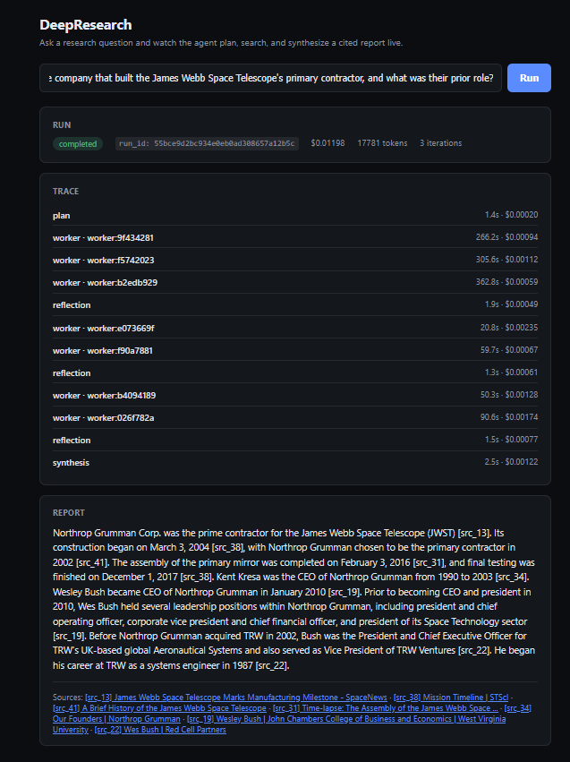

# DeepResearch

An agentic deep-research system: ask a question, get a cited report. Built
with the eval harness and CI regression gate as first-class parts of the
system, not an afterthought — every architectural choice (plan-first vs.
ReAct, rerank on/off, cache on/off) is backed by a measured ablation, not
a guess.

**Plan → parallel sub-question workers → rerank → reflection → synthesis**,
with full tracing (Langfuse Cloud/OTel), a Redis-backed search/fetch cache,
hard budget enforcement, and a Postgres run store behind it.

## Demo



```bash
python -m deepresearch.cli "Which came first, the Eiffel Tower or the Statue of Liberty?"
```

## Features

- **Multi-step research pipeline** — orchestrator plans sub-questions, a
  bounded worker pool (max 4–6) researches them in parallel, results are
  reranked, a reflection step decides whether to replan (max 2) or move to
  synthesis.
- **Cited answers, checked for it** — claims map to source IDs and are
  checked post-hoc for citation coverage/precision, not just asserted.
- **Live streaming API + UI** — `GET /research/stream` (SSE) streams
  plan/worker/reflection/synthesis progress as it happens; a small demo UI
  ships at `/ui/`.
- **Full observability** — every run gets a trace ID shared with Langfuse,
  plus Prometheus/Grafana dashboards for cache hit rate and infra metrics.
- **Real eval harness, not a toy** — FRAMES + MuSiQue benchmark runs, a
  reliability job (repeat-run variance, not point estimates), and a
  DeepResearch Bench implementation, all against a local corpus for
  reproducible, CI-safe scoring.
- **CI regression gate** — every PR runs a smoke eval against a stored
  baseline and fails on accuracy/citation/latency regressions.
- **Every default is a measured ablation** — rerank on/off, cache on/off,
  and plan-first vs. ReAct are all backed by real numbers in
  `docs/RESULTS.md`, including one case where a single run gave the wrong
  answer and a mandated 3x repeat reversed it.

## Setup

```bash
cp .env.example .env
# fill in ANTHROPIC_API_KEY and TAVILY_API_KEY
# sign up free at cloud.langfuse.com, create a project, fill in
# LANGFUSE_PUBLIC_KEY / LANGFUSE_SECRET_KEY
pip install -e ".[dev,eval]"
```

```bash
docker compose up --build -d   # starts the API, Postgres, Redis, Prometheus, Grafana
# (equivalent to `make up`, if you have make installed)
```

## Learn more

- `docs/DESIGN.md` — architecture, decision table with alternatives
  considered, eval design, run-store schema.
- `docs/RESULTS.md` — every claim above backed by real numbers: raw
  configs, ablation results, bugs found and fixed, a live AWS deploy, full
  eval runs.
