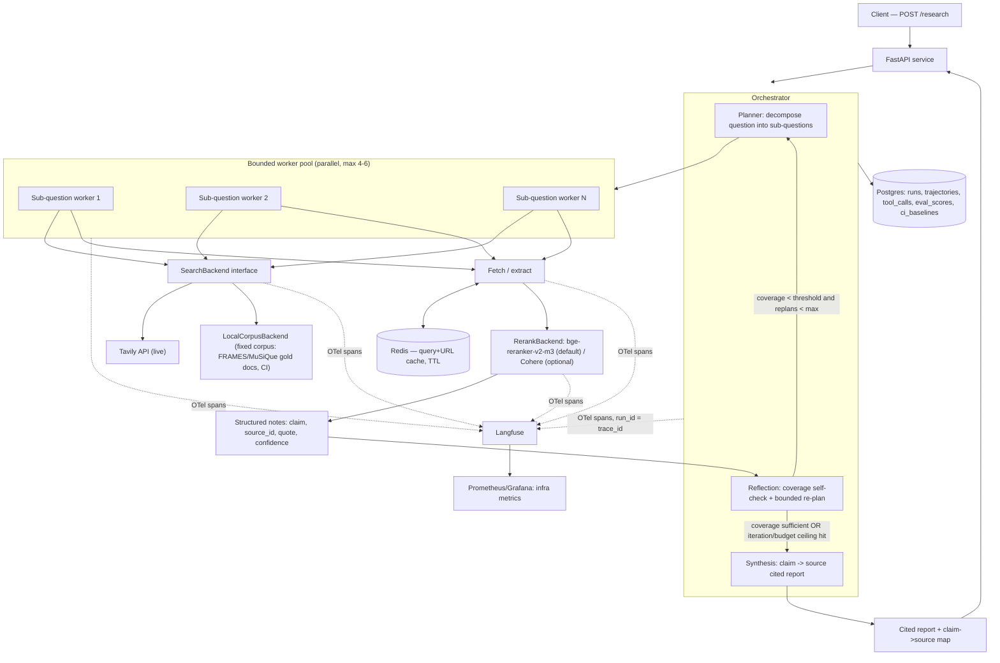
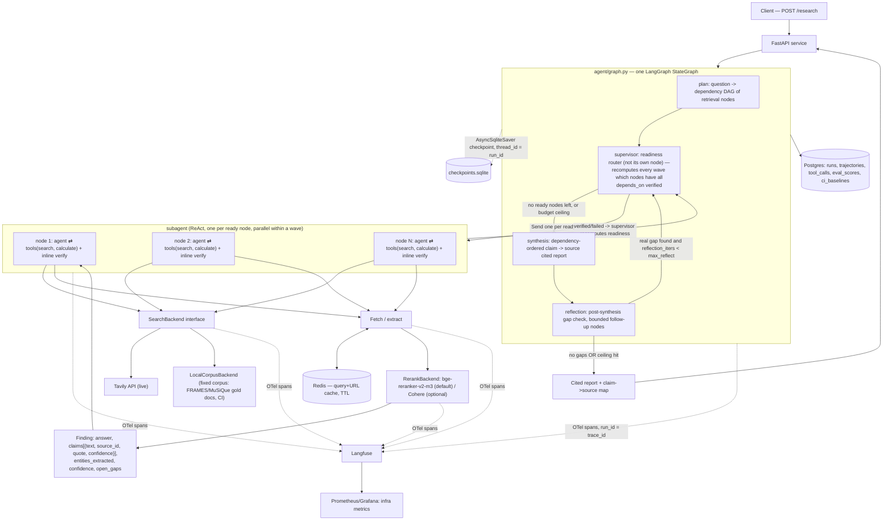

# DeepResearch — System Design

> Working name. This document is the source of truth for the project. Read it before
> writing or changing any code.

## 1. Problem statement

Agentic deep-research loops (plan → search → read → synthesize → cite) are now
commodity — every agent framework ships a tutorial for one. That loop is not what
this project is demonstrating.

What this project demonstrates: **the evals-as-a-system and AIOps discipline around
an agent**, applied to a domain (deep research) where quality is genuinely hard to
pin down — multi-hop factual accuracy, citation grounding, and report quality are
each separately measurable, and a system that can't produce numbers for its own
tradeoffs isn't a serious system. The audience is engineers evaluating system-design
maturity, not end users evaluating research reports.

Working rule, stated once here and enforced everywhere below: **every architectural
box has a metric attached, or it doesn't ship.** If a component can't be measured
(cost, latency, accuracy, or reliability), it's either instrumented before it's
built, or it's cut and logged as a non-goal with a stated hypothesis for later.

Success definition for this project: a running system where (a) every design
decision below has a recorded alternative and a stated piece of evidence that would
reverse it, (b) every run produces a queryable trajectory + cost + score record, and
(c) CI gates on regression against a stored baseline, not on vibes.

## 2. Decision table

Each row: the decision, what's chosen, what else was considered, why, and the
concrete evidence that would flip the decision. "Evidence" is deliberately specific
(an ablation result, a measured cost, a latency number) — not "if it doesn't work
out."

| # | Decision | Chosen | Alternatives considered | Why | Evidence that would change my mind |
|---|---|---|---|---|---|
| 1 | **Topology** (superseded 2026-07-18, see §11) | Supervisor + readiness-gated dependency-DAG dispatch, one topology for both breadth and depth (`agent/graph.py`): the planner emits a dependency graph of retrieval nodes (`SubQuestion.depends_on`); a supervisor router recomputes, every wave, which nodes have all dependencies verified and fans those out in parallel via `Send` (bounded by `max_workers`), while a node needing an unresolved upstream answer simply isn't ready yet and waits — no separate "parallel mode" vs. "sequential mode" | The prior bounded-parallel-pool-only topology (row 1 as originally written, kept below for history); a single sequential ReAct agent over the whole question | The old pool topology fanned out *every* sub-question in one batch, which cannot express "hop 2 needs hop 1's answer" — a dependent hop fired blind, retrieving garbage for an unresolved entity. This is this project's own measured multi-hop failure mode (docs/RESULTS.md Phase-2: 60% of MuSiQue misses were exactly this). Making the DAG explicit and gating dispatch on readiness fixes it while keeping independent sub-questions genuinely parallel — not a tradeoff between the two, both fall out of the same readiness computation. | A measured run shows the readiness-gated dispatch adds material overhead (extra waves, wasted waiting) on questions that are actually all-independent, relative to the old one-shot fan-out — i.e., the DAG machinery costs more than it buys on the common case. Response: keep a fast path where an all-independent plan (no `depends_on` edges at all) dispatches in one wave, which the current readiness computation already does for free. |
| 2 | **Planning style** (superseded 2026-07-18, see §11) | One planner, one topology: the planner emits a dependency DAG (single node for a simple lookup, a fast path); each node's research is done by a tool-calling ReAct subagent (`agent/subagent.py` — the same primitives the old `react_agent.py` mode used: `search`/`calculate` tools via LangGraph `ToolNode`), so **every** hop gets real sequential entity-substituting multi-hop *and* independent facets still run in parallel — the plan-first-vs-react_agent split is gone, folded into one design | Kept for history: plan-first with a parallel-only worker pool + bounded coverage-triggered replanning (row 2 as originally written); a separate additive `react_agent` config mode | The old split forced a choice per-run between "parallel but can't chain dependent hops" (plan-first) and "chains hops correctly but no parallelism, ~2x cost" (react_agent) — the measured reversal signal below showed react_agent won accuracy on genuinely multi-hop questions but at real cost, and there was no way to get both without running two separate architectures. The dependency-DAG topology (row 1) removes the false choice: a node is ReAct (so it chains hops correctly when it needs to) but the *supervisor*, not the node, decides parallel vs. sequential dispatch per-node based on real dependencies — independent facets don't pay the sequential cost, dependent ones don't fail silently. | The measured **2026-07-18 pre-rebuild** signal that motivated this (kept as the evidence trail): `react_agent` beat the old plan-first on MuSiQue n=20 — `answer_contains_gold` 0.60 vs 0.50 (+10pts), `answer_f1_extracted` 0.457 vs 0.415 — fixing 4 dependency-chained misses (incl. two 4-hop), at ~2x tokens / +83% cost. A live-model run of the *new* unified graph against the same MuSiQue slice, scored per-hop (not just final answer), is the next measurement that would validate (or reverse) that this rebuild actually captured react_agent's accuracy gain without paying its full cost premium on all-independent questions — not yet run against a real provider (this session was tested offline only; see §11). |
| 3 | **Stopping criteria** (revised 2026-07-18, see §11) | Per-scope explicit ceilings, first-to-trip wins at each scope: per-hop `max_corrections` (requeue a node whose verify failed, bounded), per-run `max_reflect` (bounded post-synthesis follow-up waves), per-plan `max_nodes` (planner over-decomposition guard), plus the budget ceiling (`max_total_tokens`, `max_usd`, `max_wall_clock_seconds`) checked as a pure state read at every dispatch decision | "Agent decides when it's done" (no explicit criterion); the old single coverage-self-check score ≥ threshold gate | "The agent decides" is unmeasurable and unreproducible. The old single coverage-score gate (LLM-judge scored against the whole plan, pre-synthesis) was **dropped**, not just retuned: Session 4 had already measured it as uncorrelated with downstream citation-accuracy/RACE-style report score — a bad proxy — so this rebuild replaced it with gates scoped to where they actually catch something: per-hop grounding (verify), per-run report-gap-closure (reflection), never a single global "coverage" number standing in for both. | A live-model run shows the per-hop/per-run gates above let genuinely incomplete reports through more often than the old coverage gate did (i.e., the replacement lost a real signal, not just a bad proxy) — measured via citation-precision or RACE-style score regressing at the same budget. Response: reintroduce a scoped coverage check, but validated against citation-accuracy first this time, not assumed. |
| 4 | **Context management** | Structured note-taking: each worker returns `{sub_question, claims:[{text, source_id, quote, confidence}], open_gaps}`, never a raw transcript. Token budgets enforced per stage (plan in ≤1k / out ≤500; worker in ≤8k / out ≤1k; synthesis in ≤ plan + Σ worker notes, independent of raw content volume touched) | Full-transcript stuffing into synthesis | Full-transcript cost scales with number of sub-questions × sources touched, risking context-window blowup and diluting synthesis attention across irrelevant raw text. Structured notes bound synthesis input regardless of how much a worker read. | Smoke-set measurement shows structured notes measurably drop citation-accuracy vs. full-transcript baseline by more than the token/cost savings justify. Response: enrich the note schema (longer quotes, more claims) before reverting to full-transcript. |
| 5 | **Search tooling** | Tavily as primary backend (combined search+extract, LLM-ready Markdown, relevance scoring), behind a `SearchBackend` protocol with a `LocalCorpusBackend` for fixed-corpus benchmark/CI runs | Brave Search API (SERP-only, no extraction, free tier removed Feb 2026), SerpApi (250 free searches/mo, snippets only, throughput capped at 20%/plan-hour) | Tavily is the only one of the three that returns clean extracted content in one call — Brave/SerpApi require building and maintaining a separate scrape/clean stage, which is pure ops burden for a solo engineer with no accuracy upside. Tavily's free tier (1,000 credits/mo) covers dev iteration. | Spot-check of Tavily extraction quality on a sample of research questions shows it's meaningfully worse than a scraped-Brave-result baseline (measured via citation-accuracy delta), or free-tier credits are exhausted faster than dev iteration allows. |
| 6 | **Citation grounding** | Synthesis output is structured: every claim references a `source_id` from a fetched-doc registry populated at fetch time. Post-hoc automatic checker (FACT-protocol style) reports citation *coverage* (% claims with ≥1 citation) and citation *precision* (% cited claims an LLM judge confirms are entailed by the cited source) | Free-form inline URL citations in prose | Free-form citations are regex-fragile to parse and make coverage/precision unreliable to compute — directly undermines the "measurable claim→source mapping" requirement this whole project is built around. | Structured-output constraints measurably hurt RACE-style readability/quality scores more than the measurability gain is worth. Response: relax to lightweight footnote markers only, keep the source registry for auditability. |
| 7 | **Retrieval quality** | Self-hosted cross-encoder reranker (`BAAI/bge-reranker-v2-m3`, CPU-viable at low QPS) as default, behind a `RerankBackend` protocol; Cohere Rerank API as an optional swappable backend. With/without-rerank ablation is in the eval design from day one (Session 4) | Cohere-only (managed, $2/1k searches, trial key explicitly not licensed for production use), Jina Reranker (token-billed, ongoing $ cost) | Self-hosting makes repeated CI ablation runs free and reproducible — no rate limits, no per-call cost, no trial-key legal ambiguity. A hosted option stays available behind the same interface to prove the integration works. | Self-hosted CPU reranker latency becomes the dominant contributor to end-to-end p95 and no GPU is affordable/available. Response: swap default to a hosted API for the live path, keep self-hosted for CI/ablations where $ cost matters more than latency. |
| 8 | **Caching** | Redis, keyed on `sha256(normalized_query)` for search results and `sha256(normalized_url)` for fetched/extracted pages, with per-key-type TTLs (default 24h search results, 7d extracted pages). Explicitly **a cache, not agent memory** — no cross-run carryover of reasoning/decisions, only raw search/fetch payload reuse | No caching | Repeated runs (nightly full suite, reliability repeats of the same 20-question subset 3–5×, the with/without-cache ablation itself) would otherwise re-pay full search+fetch cost every time. This is close to a strict win given the eval design already mandates repeated runs. | Measured staleness causes eval-answer drift (a cached page's content changed and now contradicts a benchmark's gold answer). Response: shorten TTL on volatile domains (news, changelogs) rather than removing caching. |
| 9 | **Run store** | Postgres: `runs`, `trajectories`, `tool_calls`, `eval_scores`, `ci_baselines` (schema in §4). Every `eval_scores`/`ci_baselines` row stores the exact config JSON + git SHA that produced it ("config-next-to-result") | Flat log files / JSON dumps | This is the evals system of record — it needs to be queryable for trend dashboards, joinable with Langfuse traces by `run_id`, and diffable for CI baseline comparison. Log files can't do any of that without custom parsing. | Postgres schema/migration overhead meaningfully slows early-session iteration speed. Response: SQLite locally with the same schema (swap connection string), Postgres in CI/deployed — a dev-loop optimization, not an architecture change. |
| 10 | **Observability dashboards** | Langfuse (built-in cost/latency/eval-score dashboards, native OTel ingestion, trace/span join via `run_id = trace_id`) **plus** Prometheus/Grafana for infra-level metrics (uptime, queue depth, error rates) | Langfuse-only | Langfuse confirmed (research, 2026) it cannot export Prometheus-format metrics — infra alerting needs a separate path. Prometheus/Grafana also demonstrates the AIOps breadth this project is meant to showcase, beyond LLM-specific cost/latency. | Prometheus/Grafana panels sit empty in practice (no infra signal worth alerting on at this scale). Response: drop them, Langfuse-only, redirect that session's time to eval breadth. |
| 11 | **DeepResearch Bench cadence** | Fixed 10-question EN-only subset (`--only_en --limit 10`) run **weekly**, not nightly. Full 100-task suite (50 zh/50 en) run **monthly or on-demand** (e.g., before a portfolio milestone), never automated nightly | Nightly full suite (rejected outright) | Researched judge cost alone (RACE: GPT-5.5, ~2 calls/question; FACT: GPT-5.4-mini, 1 extraction + 1 validation call per unique cited URL, ~15–30 URLs/report) is ~$15–35 per 100-question run for judging *only*. Adding this project's own agent execution cost (deep-research reports involve materially more tool calls than a FRAMES/MuSiQue Q&A) pushes a full nightly run toward $120–330/run — not solo-engineer-nightly-affordable by any reasonable threshold. A 10-question weekly subset keeps this to a rough $15–35/week (see §5 cost table). | Actual measured Session-4 cost per DeepResearch Bench report comes in far below this estimate (e.g., if the agent's own report generation is cheaper than assumed). Response: raise the weekly subset size, or move to nightly for the subset while keeping the full 100 monthly. |
| 12 | **Deploy compute** | ECS Fargate (cluster + service + task def, `infra/modules/ecs`) | EKS (managed Kubernetes); a raw EC2 box (docker run + systemd/cron) | EKS's control-plane fee ($0.10/hr ≈ $73/mo) alone blows the $25/mo demo budget before a single workload runs, and K8s's value (multi-node bin-packing, complex rollout strategies, operator ecosystem) buys nothing at 2–10 users on one task — it's cost and complexity with no attached metric, which this project's own "every box earns its metric" rule rejects outright. A raw EC2 box is cheaper but has no deploy story (no task-def-as-config, no rolling deploy, no separation between "role that pulls the image" and "role the app runs as") and nothing to demonstrate about IAM boundary design. Fargate sits at the point that's actually arguable: no control-plane fee, no host patching, `aws ecs update-service --force-new-deployment` is the whole deploy story, and task execution role vs. task role is a real least-privilege boundary worth showing. **This is the row that answers "why not EKS" in an interview.** | Concurrency needs outgrow what target-tracking on one task family can smooth (e.g., sustained >10-15 concurrent research runs), or a second workload needs to share the cluster's bin-packing — at that point EKS's operator ecosystem starts paying for itself and Fargate's per-task pricing stops being cheaper than densely-packed EC2 nodes. |
| 13 | **Deploy data layer** | Containers-in-task: Postgres + Redis run as additional containers in the same Fargate task definition (`infra/modules/ecs`), sharing the task's ENI (`localhost` networking) and ephemeral task storage. Managed-service Terraform (`infra/modules/data_managed`: RDS Postgres + ElastiCache Redis) is written and wired behind `var.use_managed_data_layer`, default `false` | RDS Postgres + ElastiCache Redis, always-on managed services | An ALB (~$16.4/mo fixed) + one Fargate task (0.5 vCPU/1GB ≈ $18/mo if left running 24/7) already consumes most of the $25/mo budget; adding RDS db.t3.micro (~$12-13/mo) + ElastiCache cache.t3.micro (~$12/mo) would blow it by ~2x if the stack were left running continuously. The demo's actual usage pattern — `terraform apply`, hit the live URL once to prove it, `terraform destroy` (task 4's teardown/reapply cycle) — means real spend is hours not a full month, but the *architecture* still shouldn't assume "leave it up." Containers-in-task costs nothing beyond the one task's compute and matches non-goal "no multi-tenant, single-box-shaped deployment." Both paths exist in code so the swap is a variable flip, not a rewrite, once budget allows leaving it up continuously. | A demo needs to stay up continuously (not apply→verify→destroy) and RDS/ElastiCache's ~$24-25/mo combined cost becomes affordable on its own budget line, or task-restart data loss (ephemeral storage, no volume) becomes a real problem worth paying for durability. Flip `use_managed_data_layer = true`. |
| 14 | **Orchestration engine** (rebuilt 2026-07-18, see §11) | One LangGraph `StateGraph` (`agent/graph.py`), no config-selectable alternative engine: `plan → supervisor(readiness router, not its own node) → subagent(ReAct: search/calculate via ToolNode, +inline per-hop verify) → synthesis → reflection`, `Send` for the readiness-gated wave fan-out, an `AsyncSqliteSaver` checkpointer keyed by `thread_id=run_id` (the "future Phase-3 checkpointer" this row previously deferred is now wired), budget/correction/reflection gates evaluated as pure state reads that route to synthesis/END rather than raising | Kept for history: the previous `config.orchestration` flip between this LangGraph path and the original hand-rolled `asyncio.gather` + `while True` loop (`agent/orchestrator_native.py`); a separate `agent_mode="react_agent"` LangGraph topology alongside the plan-first one | The native-vs-langgraph ablation this row originally recorded is resolved and closed out — the LangGraph path had already fully replaced native by the time this rebuild started, and native was deleted (no test exercised it, no config path selected it). This rebuild's own reason for touching orchestration again was different: the multi-hop DAG (row 1) and the collapse of plan-first/react_agent into one topology (row 2) both required real changes to `agent/graph.py`'s node set, not just a migration of the same nodes to a new engine. `langgraph.prebuilt.ToolNode` — rejected in the prior version of this row for the plan-first path's imperative search/fetch/rerank calls — is now used **inside every subagent node**, since every node is ReAct now; the rejection reasoning for the old imperative-worker path is obsolete, not wrong at the time. One real implementation finding worth recording: a static edge from a `Send`-fanned-out node coalesces into one downstream call per wave over the fully-merged state (confirmed by direct experiment) — so the per-hop verify gate had to be folded *inside* the subagent node rather than living as its own downstream node, a LangGraph mechanic this project hadn't hit before. Verified offline only (`tests/test_graph.py`, `tests/test_subagent.py`, `tests/test_checkpointer.py`, `tests/test_orchestrator_persistence.py` — 94/94 green); two real bugs (a `Send`-payload field never threaded through, causing every subagent's budget clock to start at zero; a tool-call's recorded span_id captured statically instead of from the active span) were caught by this session's own tests before any live-model run, not by a separate audit. | A live-model run (not yet performed this session) shows the unified graph's per-node ReAct cost (the thing `react_agent` measured at ~2x tokens/+83% cost vs. the old plan-first) now applies to *every* node instead of being an opt-in mode, and that cost isn't offset by only paying it on nodes that actually need multi-hop chaining. Response: investigate a cheaper non-ReAct path for leaf nodes with no `depends_on` and nothing depending on them (skip the tool-calling loop entirely for pure single-lookup facets), reintroducing exactly the imperative-worker distinction this rebuild removed, but only if the cost data justifies it. |

## 3. Architecture diagram

Superseded 2026-07-18 (see §11) — kept for history, describes the pre-rebuild
plan-first-only pool topology (decision rows 1/2/3/14 as originally written):



**Current** (see §11 for the full rationale):



## 4. Run-store schema (Postgres)

```sql
CREATE TABLE runs (
    run_id          UUID PRIMARY KEY,          -- also used as OTel trace_id (32 hex)
    created_at      TIMESTAMPTZ NOT NULL DEFAULT now(),
    benchmark_name  TEXT,                      -- NULL for live/prod queries
    config          JSONB NOT NULL,            -- full run config: model, budgets, backends, seeds
    git_sha         TEXT NOT NULL,
    status          TEXT NOT NULL,             -- running | completed | failed | budget_exceeded
    total_cost_usd  NUMERIC(10,4),
    total_latency_ms INTEGER
);

CREATE TABLE trajectories (
    id              BIGSERIAL PRIMARY KEY,
    run_id          UUID NOT NULL REFERENCES runs(run_id),
    span_id         TEXT NOT NULL,             -- OTel span id
    parent_span_id  TEXT,
    stage           TEXT NOT NULL,             -- plan | worker | reflection | synthesis
    name            TEXT NOT NULL,
    input           JSONB,
    output          JSONB,
    tokens_in       INTEGER,
    tokens_out      INTEGER,
    cost_usd        NUMERIC(10,6),
    latency_ms      INTEGER,
    started_at      TIMESTAMPTZ,
    ended_at        TIMESTAMPTZ
);

CREATE TABLE tool_calls (
    id              BIGSERIAL PRIMARY KEY,
    run_id          UUID NOT NULL REFERENCES runs(run_id),
    span_id         TEXT NOT NULL REFERENCES trajectories(span_id),
    tool_name       TEXT NOT NULL,             -- search | fetch | rerank
    args            JSONB,
    result_summary  JSONB,
    success         BOOLEAN NOT NULL,
    cache_hit       BOOLEAN NOT NULL DEFAULT false,
    latency_ms      INTEGER
);

CREATE TABLE eval_scores (
    id              BIGSERIAL PRIMARY KEY,
    run_id          UUID NOT NULL REFERENCES runs(run_id),
    benchmark_name  TEXT NOT NULL,             -- frames | musique | deepresearch_bench | trajectory | reliability
    question_id     TEXT,
    metric_name     TEXT NOT NULL,             -- accuracy | answer_f1 | support_f1 | citation_precision | ...
    value           NUMERIC,
    judge_model     TEXT,
    rubric_version  TEXT,
    raw_judge_output JSONB
);

CREATE TABLE ci_baselines (
    id              BIGSERIAL PRIMARY KEY,
    benchmark_name  TEXT NOT NULL,
    metric_name     TEXT NOT NULL,
    baseline_value  NUMERIC NOT NULL,
    config          JSONB NOT NULL,            -- config-next-to-result: exact config that produced this baseline
    git_sha         TEXT NOT NULL,
    created_at      TIMESTAMPTZ NOT NULL DEFAULT now()
);
```

`runs.run_id` doubles as the OTel trace ID (generated as a 32-hex value up front and
propagated via OTel context through the whole pipeline), so a Langfuse trace and a
Postgres run row join on the same identifier with no separate mapping table.

## 5. Eval design

### 5.1 Benchmark suite

| Benchmark | What it measures | Source | Fixed subset used | Cadence | Metric |
|---|---|---|---|---|---|
| **FRAMES** (Google DeepMind) | Multi-hop retrieval + reasoning QA | HF `google/frames-benchmark`, 824 questions, each needing 2–15 Wikipedia articles. arXiv:2409.12941. **No official small subset exists** — sampled ourselves: fixed seed (42), stratified by the dataset's `reasoning_types` column | 20-question stratified sample (PR smoke), 100-question stratified sample (nightly) — both pinned to a specific HF dataset revision hash to guard against silent dataset updates | PR smoke (20q) / nightly (100q) | LLM-judge accuracy (paper's own protocol, validated κ=0.889 vs. humans) + our citation precision/coverage on top |
| **MuSiQue** (answerable subset) | 2–4 hop composed reasoning | GitHub `StonyBrookNLP/musique` / HF mirror `bdsaglam/musique`, CC BY 4.0. Dev split: 1,252×2-hop / 760×3-hop / 405×4-hop | 20-question stratified-by-hop sample (PR smoke, from dev split since test gold is held out), 100-question stratified sample (nightly) | PR smoke (20q) / nightly (100q) | Answer F1 + Support F1 (using shipped candidate paragraphs) + our trajectory metrics |
| **DeepResearch Bench** (RACE/FACT) | Report-quality + citation grounding, closest thing to a real deep-research standard | GitHub `Ayanami0730/deep_research_bench`, arXiv:2506.11763, Apache-2.0, actively maintained. 100 tasks (50 zh/50 en). Judges: GPT-5.5 (RACE), GPT-5.4-mini (FACT) | 10-question EN-only subset (`--only_en --limit 10`) | **Weekly** (not nightly — see decision table row 11); full 100-task suite **monthly/manual** | RACE (comprehensiveness/insight/instruction-following/readability, judge-scored) + FACT (citation extraction + per-URL support validation) |

Both FRAMES and MuSiQue ship their gold supporting documents (Wikipedia articles /
candidate paragraphs respectively), so both run against the `LocalCorpusBackend` by
default — reproducible, no live-web flakiness, no rate-limit exposure in CI. A
separate, manually-triggered "live web" variant runs the same subsets against
Tavily to catch retrieval-backend regressions that a frozen corpus can't surface.

### 5.2 Agentic metrics (every run)

- **Task completion rate** — did the run finish inside budget with a synthesized report.
- **Tool-call success rate** — non-error tool responses / total tool calls.
- **Trajectory efficiency** — steps and tokens consumed per solved task.
- **Reliability** — a fixed 20-question subset repeated 3–5×; report the *distribution*
  (variance across repeats) and an all-runs-consistent rate (pass^k-style), never a
  single point estimate.

### 5.3 System metrics (every run)

- p50 / p95 end-to-end latency.
- Cost per query, decomposed: search API / LLM / judge.
- Cache hit rate and $-saved-by-cache (`cache_hits × avg_cost_of_a_miss` for that call type).

### 5.4 Ablations (committed from day one, Session 4)

| Ablation | What it isolates | How it's run |
|---|---|---|
| With/without rerank | Retrieval-quality contribution of the cross-encoder stage | Same FRAMES/MuSiQue smoke subset, rerank stage toggled via config, accuracy + citation precision + latency/cost delta reported |
| With/without cache | Latency + cost contribution of the Redis layer | Same subset run twice back-to-back: cold (empty cache) then warm; latency + cost delta reported |
| Plan-first vs. ReAct | The planning-style decision (row 2) | Same smoke set, both planning modes, accuracy/citation-precision/tokens/latency compared — this is the flagship ablation for the design-decision narrative |

### 5.5 Judge protocol

- **Default judge**: a cheap model class (comparable to GPT-5.4-mini) for internal
  citation-precision and coverage-self-check scoring. Judge verdicts are cached by
  `sha256(claim_text + source_id)` so repeat runs against unchanged content never
  re-pay judge cost.
- **Pairwise comparisons** (e.g. plan-first vs. ReAct report quality): randomized
  ordering (A/B position) and blinded agent-variant identity in the judge prompt, to
  avoid position/identity bias.
- **Versioning**: judge model name and rubric version are stored as columns on every
  `eval_scores` row. This is not hypothetical — DeepResearch Bench's own reference
  implementation had to migrate its default judge off Gemini-2.5 after Google's
  deprecation; without versioned judge tracking, that kind of switch silently shifts
  every downstream score.

### 5.6 Cost estimate per eval run

All figures are engineering estimates pending Session 4 measurement; once real runs
land, the *measured* cost replaces the estimate in the baseline record itself
(config-next-to-result — the baseline is never a bare number).

| Run type | Composition | Rough cost | Rough wall-clock |
|---|---|---|---|
| PR smoke | 20 FRAMES + 20 MuSiQue (local corpus) + plan-first-vs-ReAct dup + cached cheap-judge scoring | ~$2–5 | <10 min (parallel workers) |
| Nightly full | 100 FRAMES + 100 MuSiQue + rerank ablation (2×) + cache ablation + reliability repeat (20q ×5) | ~$20–30 | tens of minutes |
| DeepResearch Bench weekly (10q EN) | Judge cost ~$1.50–3.50 (scaled from researched $15–35/100q) + agent execution ~$10–30 | ~$15–35/week | — |
| DeepResearch Bench full (100q, monthly/manual) | Judge cost ~$15–35 + agent execution ~$100–300 | ~$120–330/run | — |

## 6. Observability plan

- **OTel spans** over every stage — plan, each sub-question worker, search call,
  fetch, rerank, reflection, synthesis — carrying token/cost/latency attributes.
  `run_id` (generated up front as a 32-hex value) is set explicitly as the OTel trace
  ID and propagated through context across the parallel worker pool.
  **Open risk, flagged for a Session-2 spike**: OTel context/baggage propagation
  across truly concurrent async workers (vs. sequential chains) is asserted in
  Langfuse's docs but not something research turned up a concrete tested example
  for — verify it holds before relying on it architecturally.
- **Langfuse Cloud** (free/hobby tier), reversed from the original self-hosted
  docker-compose default. Self-hosting Langfuse v3 needs its own
  Postgres + ClickHouse + Redis/Valkey + S3-compatible blob storage (MinIO
  locally) on top of the app's own Postgres/Redis — 5 extra containers and 3
  generated secrets (`NEXTAUTH_SECRET`/`SALT`/`ENCRYPTION_KEY`) that bought
  nothing for a single-developer local/demo setup. Cloud accepts OTLP directly
  at `/api/public/otel` (Basic Auth via base64 `pk:sk`) exactly like the
  self-hosted instance, so no code or SDK change — only `LANGFUSE_HOST` and a
  project's public/secret keys differ. `docker-compose.yml` no longer stands
  up `langfuse-db`/`langfuse-redis`/`langfuse-clickhouse`/`langfuse-minio`/
  `langfuse-web`/`langfuse-worker`. Self-hosting remains documented here as a
  fallback if data residency ever requires it, but is not the default.
- **Prometheus + Grafana**, layered on top for infra-level metrics (service uptime,
  queue depth, error rates) that Langfuse cannot export in Prometheus format
  (confirmed open feature request, not shipped as of this research).
- **GitHub Actions**: `pr-smoke.yml` runs the PR smoke suite and gates on regression
  vs. the `ci_baselines` table (fails the check if a tracked metric regresses beyond
  a configured tolerance); `nightly.yml` runs the full suite on a cron schedule and
  uploads a metric-table artifact.
- **docker-compose**: agent API, Redis, Postgres, Prometheus, Grafana — the full
  local stack. Langfuse itself runs on Langfuse Cloud (see above), not in
  docker-compose.
- **Deployment target** (superseded by decision rows 12-13, `infra/`): AWS ECS
  Fargate behind an Application Load Balancer, `infra/` (Terraform). Networking
  uses public subnets with tasks getting a public IP directly — **no NAT
  gateway** (~$32/mo fixed cost that buys nothing extra for outbound-only
  traffic from a single task). Autoscaling target-tracks
  `ALBRequestCountPerTarget`, not CPU: this is an I/O-bound workload (each
  request spends most of its wall-clock waiting on Anthropic/Tavily network
  calls, not burning CPU), so CPU utilization under-signals real load — request
  count per target is the metric that actually reflects "this task is at
  capacity." Listener is HTTP-only for the demo (no ACM cert/domain in scope).
  Designed for teardown: `terraform destroy` plus `scripts/residual_check.sh`
  (tag-based residual-resource sweep) is the clean, complete teardown — see
  `infra/README.md`. Local dev still uses `docker compose down -v`.
- **`.github/workflows/deploy.yml`** (keyless OIDC via `infra/modules/github_oidc`,
  auto-rollback to the prior ECS task-definition revision on failed health check)
  runs on every push to `main`. Since infra is designed for teardown (row above),
  **this workflow is expected to fail whenever infra isn't currently applied** — a
  guard step checks `AWS_DEPLOY_ROLE_ARN` looks like a real role ARN and fails fast
  with a readable message pointing at the `terraform apply` + variable-set steps,
  rather than surfacing `aws-actions/configure-aws-credentials`'s generic "Source
  Account ID is needed" error. A red `deploy` check on `main` does not by itself
  mean the pipeline is broken — check whether infra is currently up first.

## 7. Non-goals (explicit, with reasoning)

- **No Neo4j / graph retrieval in v1.** Deferred as a future *measured* experiment
  with a stated hypothesis: explicit entity/relation graph retrieval improves
  multi-hop accuracy on FRAMES questions requiring ≥4 supporting documents, versus
  flat chunk retrieval + rerank, by reducing missed bridging entities. Testable once
  Session 4's eval data shows whether flat-pipeline failures are retrieval-coverage
  failures (graph retrieval could plausibly fix) or reasoning/synthesis failures
  (it wouldn't). Building graph retrieval before that failure-mode data exists would
  be speculative infrastructure with no attached metric — exactly what this project
  refuses to ship.
- **No cross-session user memory.** None of FRAMES, MuSiQue, or DeepResearch Bench
  measure multi-session personalization or memory recall — there is no benchmark
  that could demonstrate this doesn't regress quality or leak stale context across
  sessions. Untested by any benchmark = unshippable by this project's own standard.
  Stays out until a benchmark (public or in-house) exists to measure it.
- **No multi-tenant auth.** This is a single-user portfolio deployment. Auth/tenancy
  isolation is undifferentiated infrastructure relative to the project's stated
  goal (system-design tradeoffs + evals/AIOps), and it adds attack surface
  disproportionate to a teardown-friendly single-box deployment target.

## 8. Risks and mitigations

| Risk | Description | Mitigation |
|---|---|---|
| **Benchmark drift** | Public benchmarks (FRAMES, MuSiQue) risk future pretraining-data leakage as they age; judge models get deprecated (DeepResearch Bench's reference implementation already had to migrate off Gemini-2.5) | Pin benchmark dataset revisions (HF commit hash) in run config; store judge model + rubric version on every score row; re-baseline explicitly (new `ci_baselines` rows, not silent overwrite) whenever a judge model version changes |
| **Judge cost blowups** | LLM-judge scoring (RACE/FACT especially) can silently balloon — FACT alone issues one validation call per unique cited URL (~15–30/report) | Cache judge verdicts by content hash + rubric version; hard budget ceiling per run with a kill switch; cheap judge model by default, escalate to an expensive judge only for flagged/borderline cases |
| **Search API rate limits** | Tavily's dev key caps at 100 RPM; a nightly full suite with several parallel sub-question workers per question across 100+ questions can approach that ceiling | Bound the worker pool size to stay under the RPM ceiling; exponential backoff on 429s; `LocalCorpusBackend` removes rate-limit exposure entirely for benchmark/CI runs — only genuinely live/prod queries touch the real API |

## 9. Session map

Six build sessions. Each session's success criterion is "the stated files exist,
the stated verification passes" — not "the feature feels done."

| Session | Scope | Key files | Verify |
|---|---|---|---|
| **1 — Core loop + interfaces** | Repo scaffolding, config system, `SearchBackend` protocol with `TavilyBackend` + `LocalCorpusBackend`, planner, single-worker baseline, non-streaming FastAPI skeleton | `pyproject.toml`, `src/deepresearch/config.py`, `src/deepresearch/backends/{base,tavily,local_corpus}.py`, `src/deepresearch/agent/planner.py`, `src/deepresearch/agent/worker.py`, `src/deepresearch/api/main.py`, `tests/` | `POST /research` returns a report end-to-end against `LocalCorpusBackend` with no external calls |
| **2 — Orchestrator, compression, stopping** | Bounded async worker pool, structured note schema, reflection/coverage self-check, budget-ceiling enforcement, structured claim→source synthesis output | `src/deepresearch/agent/orchestrator.py`, `.../reflection.py`, `.../synthesis.py`, `.../notes.py`, `.../stopping.py` | A multi-sub-question run produces N parallel worker traces and stops on whichever gate (iteration/coverage/budget) trips first, verified by a forced-budget test |
| **3 — Retrieval quality** | `RerankBackend` protocol (bge-reranker-v2-m3 default, Cohere optional), Redis cache for search+fetch keyed/TTL'd, fetch/extract pipeline | `src/deepresearch/rerank/{base,bge,cohere}.py`, `src/deepresearch/cache/redis_cache.py`, `src/deepresearch/fetch/extractor.py` | Cache-hit metric and $-saved appear in run output; with/without-rerank toggle produces two distinct trajectory records |
| **4 — Eval harness** | FRAMES/MuSiQue loaders + deterministic stratified samplers, DeepResearch Bench runner wrapper, citation-accuracy checker, trajectory/reliability metrics, cached+versioned judge protocol | `eval/benchmarks/{frames,musique,deepresearch_bench}.py`, `eval/metrics/{trajectory,citation,reliability}.py`, `eval/judge.py`, `eval/run_eval.py` | PR-smoke subset (20+20) runs end-to-end and writes real `eval_scores` rows with non-placeholder cost numbers |
| **5 — Run store + observability + CI** | Postgres schema/migrations, OTel instrumentation with `run_id = trace_id` across all stages, Langfuse docker-compose, Prometheus/Grafana dashboards, CI baseline diffing | `db/migrations/*.sql`, `src/deepresearch/telemetry/otel_setup.py`, `docker-compose.yml`, `grafana/dashboards/*.json`, `.github/workflows/{pr-smoke,nightly}.yml` | A run's Postgres row and its Langfuse trace share `run_id`; PR-smoke workflow fails a deliberately-regressed metric against a stored baseline |
| **6 — Streaming API + deploy** | SSE streaming progress on `POST /research`, `GET /runs/{id}`, full docker-compose integration, deploy to ECS Fargate, teardown docs; thin UI optional and last | `src/deepresearch/api/streaming.py`, `.../routes_runs.py`, `infra/` (Terraform: ECR/ECS/ALB/IAM/budget), `scripts/deploy.sh`, `scripts/residual_check.sh`, optional `ui/` | A live ALB URL streams a real research run end-to-end; `terraform destroy` + `scripts/residual_check.sh` tear down cleanly |

## 10. Addendum (2026-07-02) — architecture ablation: plan-first vs. ReAct, worker-pool-size sweep

CI session brief: "the ablation that powers your 'I chose X over Y' story." Both
axes below are decision-table rows 1 (topology) and 2 (planning style) — this is
the flagship ablation §5.4 already promised, run once and recorded rather than
argued architecturally.

**Method**: same MuSiQue smoke subset (n=20, stratified-by-hop, seed 42, local
corpus — `eval/benchmarks/musique.py`), three variants, one run each:

| Variant | Config | Wall-clock/question | Mean tokens/solved | Mean tool-call steps/solved | Mean iterations/question |
|---|---|---|---|---|---|
| `plan_first_pool4` (current default) | `planning_style=plan_first, max_workers=4` | 5.40s | 1324 | 8.0 | 1.0 |
| `plan_first_pool1` (row 1 sweep) | `planning_style=plan_first, max_workers=1` | 5.90s | 1324 | 8.0 | 1.0 |
| `react` (row 2 alternative) | `planning_style=react, max_react_steps=4` | 9.82s | 2506 | 16.0 | 2.0 |

Raw data: `results/architecture_ablation_20260702T164109Z.json`. Recorded
`git_sha` on these runs is `no-git` — this ablation ran before this session's
`git init` (below); the run-store rows are otherwise complete and real.

**Sandbox caveat, stated once, applies to every number above and below it**:
no `ANTHROPIC_API_KEY` in this sandbox (same constraint as every prior
session), so this ran against `FakeLLMClient`. Wall-clock, token count, and
tool-call step count are **real** — they come from actually executing
`react.py`'s and `orchestrator.py`'s real control flow, real search/fetch/
rerank calls, and real (if not intelligent) LLM round-trips over the network-
free local corpus. `mean_answer_f1` / `mean_answer_contains_gold` are **not**
real quality signal — `FakeLLMClient` echoes random snippets and stops
react's loop by a hardcoded "2 notes gathered" rule (`eval/fake_llm.py`), not
by judging actual coverage. Do not cite those two columns (omitted from the
table above on purpose) as evidence about which planning style produces
better answers — only a live-key run can say that.

**Finding 1 — planning style (row 2, flagship ablation)**: `react` costs
~1.9x plan-first's tokens (2506 vs 1324) and ~1.8x its wall-clock (9.82s vs
5.40s) per question, with exactly double the tool-call steps (16 vs 8). This
is not a `FakeLLMClient` artifact of the specific echo/stop logic — it's
structural: `react.py`'s `next_action` step is one extra LLM round-trip
*per query decided*, where `planner.py`'s `plan` step is one LLM round-trip
*total*, regardless of how many sub-questions it returns. For MuSiQue's
2-4-hop questions (2-4 sub-questions per plan-first plan), one upfront
decomposition call is mechanically cheaper than paying the same per-query
decision cost incrementally. **Row 2's decision (plan-first default)
stands** — now on a directly measured cost basis, not just the original
architectural argument. The one open question row 2 flags as
decision-reversing evidence (ReAct matching plan-first's *accuracy* at lower
cost) is exactly the one thing this run cannot speak to, per the caveat
above; that comparison needs a live-key re-run before the decision can be
called fully closed either way.

**Finding 2 — worker-pool size (row 1 sweep)**: `max_workers=1` vs. `4`
produced almost identical wall-clock (5.90s vs 5.40s per question) and
*identical* token/step counts (1324 tokens, 8 steps, both variants) — the
pool size didn't matter on this subset. This is directionally consistent
with, but not yet strong enough to act on, row 1's own stated
decision-reversing evidence ("most benchmark questions have ≤1 effectively
independent sub-question, parallelism buys nothing"): MuSiQue's 2-4-hop
questions decompose into small plans (2-4 sub-questions, frequently
overlapping/dependent given the hop structure), so a pool of 4 rarely has
more than 1-2 workers in flight concurrently regardless of the ceiling.
**Row 1's decision (bounded parallel pool, max 4-6) is not reversed by this
result**, but the result doesn't validate it either — it's simply a
subset where the ceiling wasn't tested under real width. FRAMES questions
(2-15 Wikipedia articles, wider sub-question fan-out plausible) are the more
informative corpus for this specific sweep and weren't run this session
(same wall-clock-cost tradeoff flagged in the evals-as-a-system session's
FRAMES-full deferral — rerank cost alone made FRAMES-full ~2-2.5hr;
re-running here too was out of scope this session). **Recommended follow-up,
not done**: repeat this exact sweep against a FRAMES smoke subset before
treating row 1 as fully validated.

**Net**: no reversal of either decision-table row. The honest surprise is
the *size* of finding 1's cost gap (react isn't marginally more expensive,
it's ~2x on every real mechanical axis) and the honest gap in finding 2
(this subset's questions are too narrow to actually stress the thing the
sweep was meant to test).

## 11. Addendum (2026-07-18) — unified planner→supervisor→subagent→verify→synthesis→reflection rebuild

Directive: collapse the three parallel orchestration topologies that had
accumulated (plan-first parallel pool, thin sequential `react` mode, the
standalone tool-calling `react_agent`) plus the retained hand-rolled
`orchestrator_native.py` ablation baseline, into **one** LangGraph
`StateGraph` that does what none of the three did alone: an explicit
multi-hop dependency DAG, readiness-gated wave dispatch (parallel where
independent, sequential where dependent — one topology, not a config flip
between two), a tool-calling ReAct subagent per plan node, a per-hop
grounding gate, dependency-ordered cited synthesis, and a bounded
post-synthesis reflection loop. Plus: wire the LangGraph checkpointer
this project had deferred as a "future Phase-3" item since the original
langgraph migration (decision row 14).

**What changed, mapped to the decision table**: rows 1 (topology), 2
(planning style), 3 (stopping criteria), and 14 (orchestration engine) are
superseded/revised above, each with its own before/after and reversal
evidence. Row 4 (context management)'s underlying principle — structured
notes, never raw transcript — is unchanged; only the container renamed
(`WorkerNotes` → `Finding`, gaining `entities_extracted` specifically to fuel
`facts_for()`'s upstream-entity injection into a dependent hop's brief).

**New data contract**: `Finding {node_id, question, answer, claims, entities_extracted, confidence, open_gaps, verified}`
replaces the old worker-only `WorkerNotes` as the primary per-node research
artifact (`WorkerNotes` is still produced, as a compatibility adapter, so
`eval/metrics/citation.py` — which reads `worker_notes[].claims` — didn't
need to change). `SubQuestion` gained `depends_on: list[str]`, making it the
plan's DAG node (`agent/dag.py` validates the graph — unique ids, known
deps, acyclic, within a new `max_nodes` over-decomposition ceiling — before
the supervisor ever sees it).

**Node-granularity rule, new and load-bearing**: a plan node exists *iff* it
requires retrieval. The planner is explicitly instructed never to emit a
compare/aggregate/compute node ("compare the two birth years") — that step
happens in synthesis once all dependency-graph nodes resolve, never as a
node of its own. Exact arithmetic (FRAMES-style numeric questions) rides the
owning hop's own `calculate` tool call by default; only a question that
computes across *multiple independent* findings would need a terminal
compute node, and the planner is steered away from that as the common case.

**A real LangGraph mechanic learned the hard way, worth recording for future
sessions**: the original 3-node sketch for this design (`subagent → verify →
supervisor`, verify as its own node) does not survive real parallel `Send`
fan-out. Confirmed by a standalone repro before writing any production
code: a static edge from a `Send`-fanned-out node coalesces into **one**
downstream call per wave, and that call sees the fully merged state of every
parallel branch — there is no way for a separate `verify` node to know which
finding belongs to which branch. The fix: fold the verify check *inside*
the same `Send`-dispatched node that ran the ReAct subagent, before it
returns its state update. Functionally identical to the sketch; structurally
necessary for correctness under real concurrency.

**Two real bugs this rebuild's own test suite caught before any live-model
run** (neither pre-existing — both introduced by this rebuild's own new
code, only surfaced once a test exercised a genuine multi-turn tool-calling
loop with a live budget check, which no earlier phase's tests happened to
do): the supervisor's `Send` payload never carried `started_monotonic`
forward, so every subagent's inner ReAct loop computed elapsed wall-clock
time from epoch zero, instantly tripping the budget gate and silently
skipping every tool call after one turn; and the `search`/`calculate` tools
recorded `tool_calls.span_id` from a static value captured once at
context-construction time instead of the dynamically-active OTel span,
breaking the FK-style relationship between a tool call and the trajectory
row it nests under. Both fixed; both now covered by regression tests
(`tests/test_orchestrator_persistence.py`'s tool-call-FK assertion,
`tests/test_checkpointer.py`/`tests/test_graph.py`'s live budget-path
coverage).

**Checkpointer**: `langgraph-checkpoint-sqlite`'s `AsyncSqliteSaver`, keyed
by `thread_id=run_id`, wired into `agent/orchestrator.py`. A new
`resume_run_id` parameter on `run_research()` reuses the original `runs` row
(no duplicate-key insert) and passes `input=None` to `graph.astream` —
LangGraph's documented resume idiom, continuing from the last checkpointed
superstep rather than restarting. Verified with `interrupt_after=["plan"]`
(LangGraph's own durable-pause mechanism, chosen over manually racing an
async generator mid-stream, which isn't deterministic) plus a call-counting
stub proving `plan_node` never re-runs on resume, and a second test proving
a different `thread_id` against the same checkpointer file starts a
genuinely independent run.

**Scope verified this session**: the test suite in this addendum's scope
(`tests/test_planner.py`, `test_subagent.py`, `test_graph.py`,
`test_checkpointer.py`, `test_orchestrator_persistence.py`) runs offline
against stubbed structured-JSON LLMs and stubbed LangChain chat models, no
network, no real provider key — 94/94 green. A same-day follow-up (see
docs/RESULTS.md's next entry) additionally ran the unified graph live against
a real model (`google/gemini-2.5-flash` via OpenRouter) on one genuine 2-hop
dependency question, end-to-end, correctly — the first real-model smoke
signal, not just offline mechanics. That is one hand-picked question, not a
benchmark; the row-2 evidence column above still names the actual open
measurement: a live-model MuSiQue slice, scored per-hop, to confirm this
rebuild captures `react_agent`'s multi-hop accuracy gain (measured
2026-07-18, pre-rebuild) without paying its full ~2x-cost premium on
all-independent questions.

That same follow-up also replaced `llm/client.py`'s hand-rolled JSON-schema
dicts + manual `json.loads` with the `instructor` library
(`response_model=<PydanticModel>`, renamed `complete_json` →
`complete_structured`) — every structured LLM call site now shares one
source of truth (a Pydantic model) instead of a schema dict kept in sync by
hand, plus automatic validation-retry. One real, non-obvious finding from
that swap: Instructor's default `Mode.TOOLS` silently flattened nested
`SubQuestion` objects into plain strings for `google/gemini-2.5-flash`,
never converging across 4 auto-retries — fixed by explicitly pinning
`Mode.JSON_SCHEMA` (OpenRouter) / `Mode.ANTHROPIC_JSON` (Anthropic, chosen by
the same reasoning but not live-verified — Anthropic credit still
exhausted), matching the API-native structured-output mechanism the
pre-Instructor code already used. Verified at parity cost/tokens with the
pre-swap live run. Full details in docs/RESULTS.md.

**Files added**: `agent/dag.py`, `agent/subagent.py`, new prompts
`finding_v1.txt` / `hop_verify_v1.txt` / `reflection_post_synthesis_v1.txt`,
`tests/test_planner.py` / `test_subagent.py` / `test_graph.py` /
`test_checkpointer.py`. **Files deleted**: `agent/orchestrator_native.py`,
`agent/react.py`, `agent/worker.py`, `agent/reflection.py`,
`agent/multihop_graph.py` (its content became the new `agent/graph.py`;
the old `graph.py` it replaced is gone), `prompts/worker_v1.txt` /
`react_v1.txt` / `reflection_v1.txt` / `finalize_v1.txt` / `verify_v1.txt`,
`scripts/architecture_ablation.py`, `tests/test_graph_parity.py`,
`tests/test_multihop_graph.py` (renamed `test_graph.py`). **Config fields
removed**: `orchestration`, `agent_mode`, `planning_style`,
`coverage_threshold`. **Config fields added**: `max_nodes`, `max_reflect`,
`checkpoint_db_path`.
